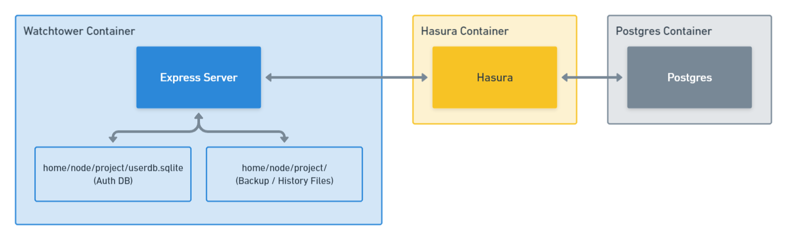

## Background

Looking to build a server which interfaces with my Hasura instance to enable:
- An additional authentication layer on top of my Hasura API (to allow multi-user management).
- A log/history of changes made to my Hasura metadata.
- A log/history of changes made to my database through Hasura.